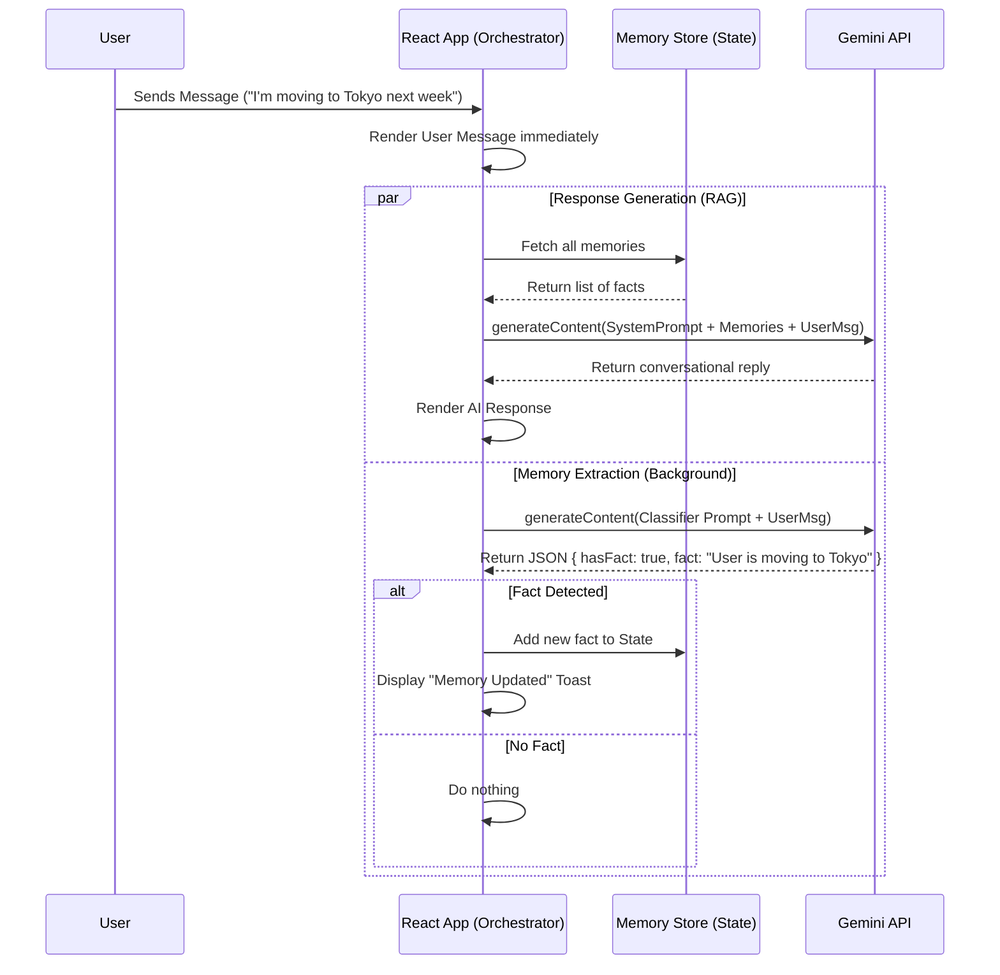

# Nova - Memory AI Architecture

Nova is a React-based AI companion application that implements a persistent memory system using a simulated Retrieval-Augmented Generation (RAG) architecture powered by the Google Gemini API.

## 1. High-Level Overview

The application is built on a "Dual-Process" architecture where every user interaction triggers two parallel workflows:
1.  **Conversational Response**: Generates an immediate, context-aware reply.
2.  **Memory Extraction**: Analyzes the input in the background to identify and store long-term facts.

In this client-side simulation, the "Vector Database" is replaced by a local React state (list of strings), but the architectural pattern mirrors enterprise RAG systems.

## 2. Core Components

### A. The Brain (Gemini 2.5 Flash)
*   **Role**: Handles logic, natural language generation, and classification.
*   **Model**: `gemini-2.5-flash`.
*   **Tasks**:
    *   `generateReply`: chatting with the user.
    *   `extractFact`: classifying text as facts vs. chit-chat (JSON mode).
    *   `transcribeAudio`: converting speech to text.

### B. The Memory Store (Simulated)
*   **Role**: Stores persistent facts about the user.
*   **Implementation**: A React State array (`Memory[]`) containing objects with text, timestamp, and category.
*   **RAG Implementation**: Before generating a reply, the app retrieves all stored memories and injects them into the System Instruction of the LLM.

### C. The Frontend (React + Tailwind)
*   **Role**: Manages state, UI rendering, and audio recording.
*   **Key Files**:
    *   `App.tsx`: The orchestrator that manages the parallel execution of replying and remembering.
    *   `geminiService.ts`: The interface layer for Gemini API calls.

## 3. Data Flow & Logic

### Step 1: User Input
The user provides input via text or microphone. Audio is first transcribed to text using Gemini's multimodal capabilities.

### Step 2: Parallel Execution
Once text is available, `App.tsx` initiates two asynchronous operations simultaneously:

*   **Thread A (Fast): Response Generation**
    1.  The app gathers the last 10 chat messages (Conversation History).
    2.  The app gathers *all* items from the Memory Store (Context).
    3.  A prompt is constructed: `System Instruction + Known Facts + Conversation History + User Input`.
    4.  Gemini generates a persona-based response.

*   **Thread B (Background): Fact Extraction**
    1.  The User Input is sent to Gemini with a specific "Classifier Prompt".
    2.  Gemini analyzes if the input contains permanent information (e.g., "I am allergic to peanuts").
    3.  **Output**: A JSON object `{ hasFact: boolean, fact: string }`.
    4.  If `hasFact` is true, the new fact is added to the Memory Store and the UI shows a "Memory Updated" notification.

### Step 3: Data Import & Export
The application supports manual backup and restoration of the "Brain" (Memories + Chat History).

*   **Data Structure**:
    The backup is a JSON object containing:
    *   `version`: Number (schema version)
    *   `exportedAt`: ISO Date string
    *   `memories`: Array of Memory objects
    *   `messages`: Array of Message objects

*   **Export Process**:
    1.  User clicks "Export".
    2.  App serializes the current `memories` and `messages` state to a JSON blob.
    3.  A client-side download is triggered for a file named `nova-memory-[date].json`.

*   **Import Process**:
    1.  User selects a `.json` file via the hidden file input.
    2.  `FileReader` reads the text content.
    3.  App parses the JSON and "revives" date strings back into Date objects.
    4.  **Validation**: Checks for existence of `memories` and `messages` arrays.
    5.  **Confirmation**: Asks user to confirm overwriting current data.
    6.  **Hydration**: Replaces React state with the imported data.

## 4. Sequence Diagram

The following diagram illustrates the lifecycle of a single message:

## 5. Technical Stack

*   **Framework**: React 19
*   **Language**: TypeScript
*   **Styling**: Tailwind CSS
*   **AI SDK**: `@google/genai` (Google Gemini API)
*   **Audio**: Native Browser `MediaRecorder` API
